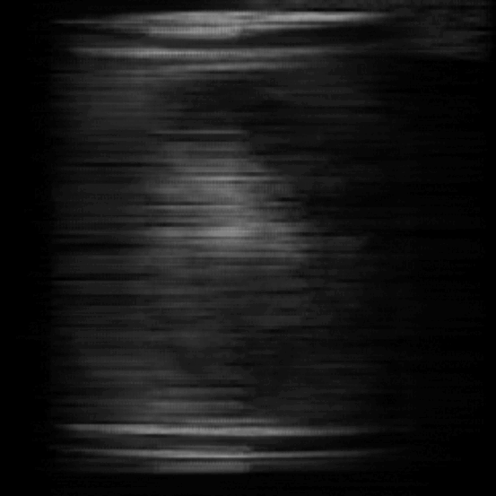
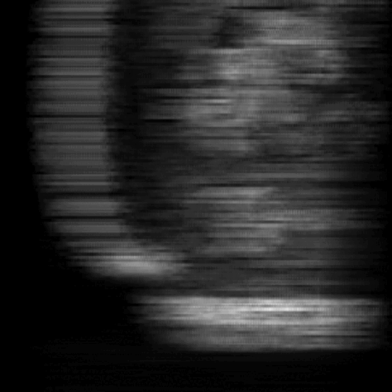
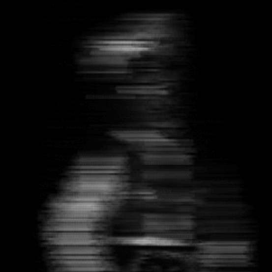
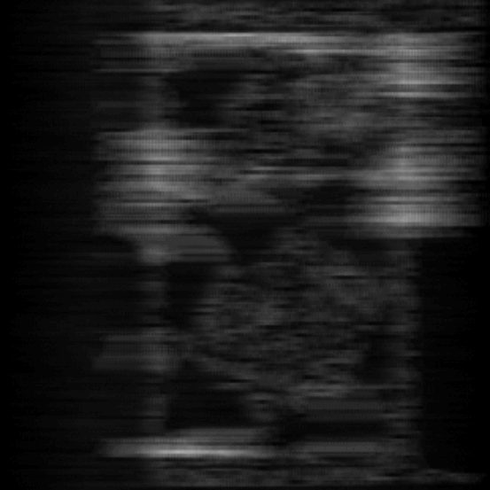
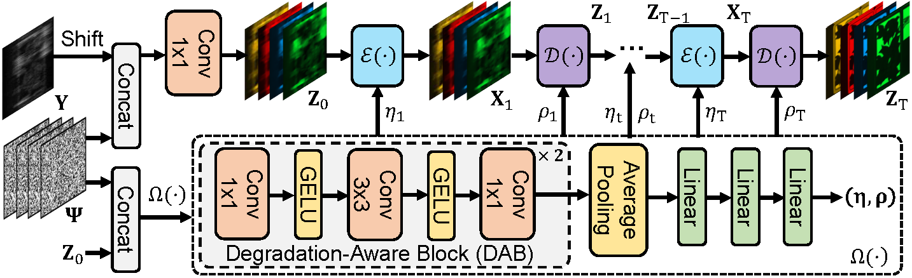
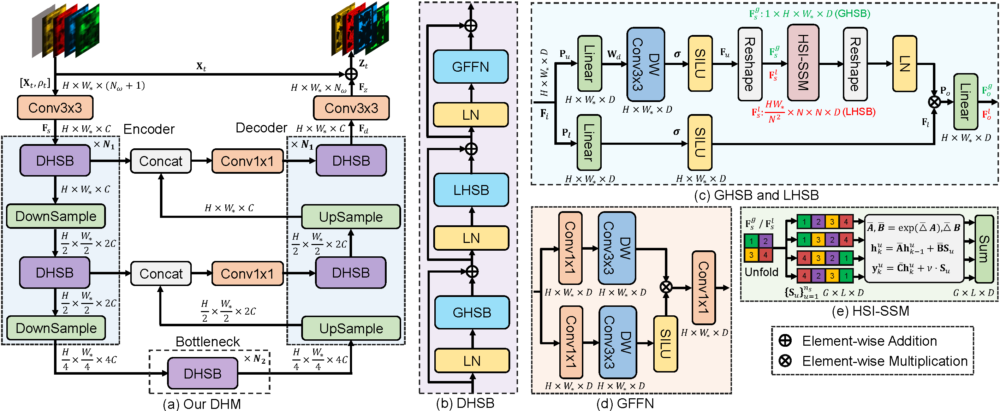
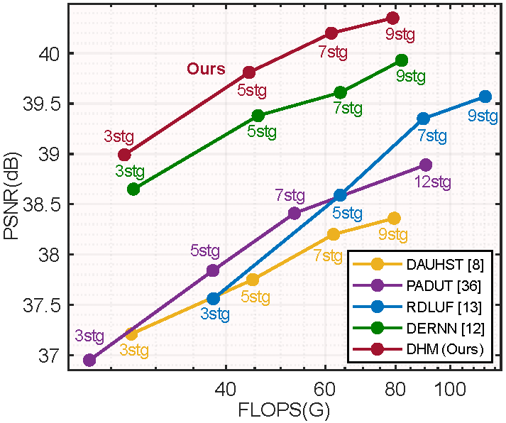
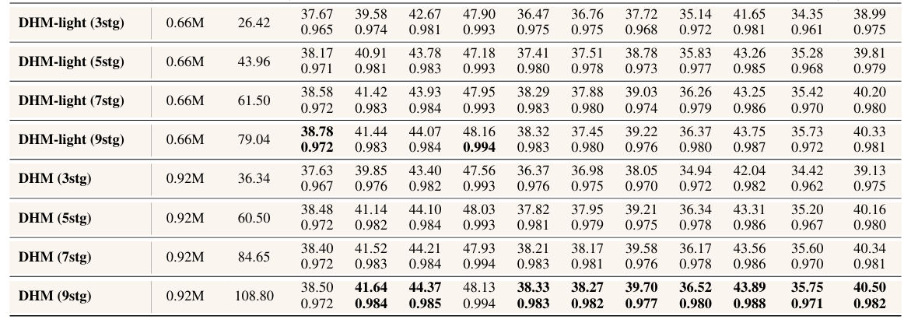
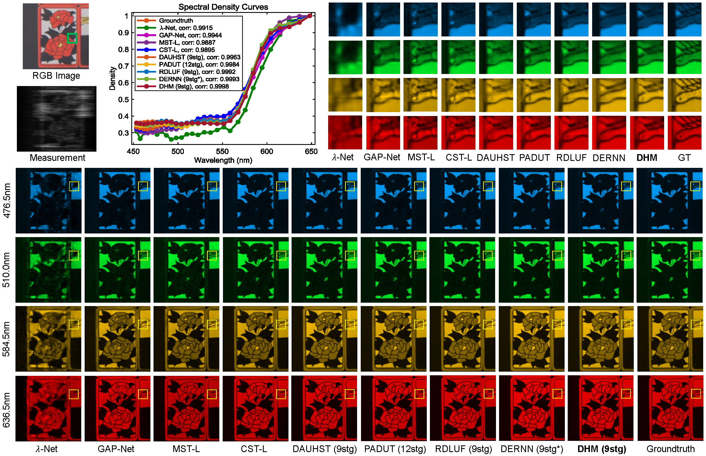
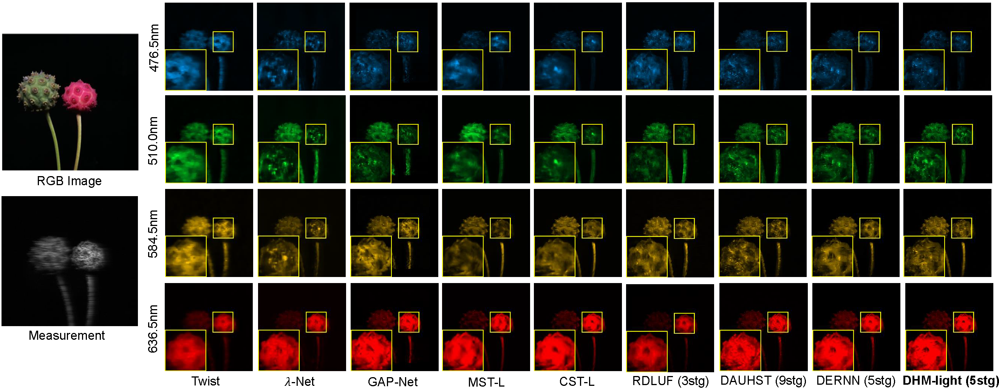

# Dual Hyperspectral Mamba for Efficient Spectral Compressive Imaging

Jiahua Dong, Hui Yin, Hongliu Li, Wenbo Li, Yulun Zhang, Salman Khan, Fahad Khan, "Dual Hyperspectral Mamba for Efficient Spectral
 Compressive Imaging", arXiv, 2024

arXiv 

|                          *Scene 1*                           |                          *Scene 5*                           |                          *Scene 6*                           |                          *Scene 7*                           |
| :----------------------------------------------------------: | :----------------------------------------------------------: | :----------------------------------------------------------: | :----------------------------------------------------------: |
|  |  |  |  |

---

#### 🔥🔥🔥 News

- **2024-5-29:** This repo is released.

---

> **Abstract:**  Deep unfolding methods have made impressive progress in restoring 3D hyperspectral images (HSIs) from 2D measurements through convolution neural networks or
 Transformers in spectral compressive imaging. However, they cannot efficiently
 capture long-range dependencies using global receptive fields, which significantly
 limits their performance in HSI reconstruction. Moreover, these methods may
 suffer from local context neglect if we directly utilize Mamba to unfold a 2D
 feature map as a 1D sequence for modeling global long-range dependencies. To
 address these challenges, we propose a novel Dual Hyperspectral Mamba (DHM)
 to explore both global long-range dependencies and local contexts for efficient
 HSI reconstruction. After learning informative parameters to estimate degradation
 patterns of the CASSI system, we use them to scale the linear projection and offer
 noise level for the denoiser (*i.e.*, our proposed DHM). Specifically, our DHM
 consists of multiple dual hyperspectral S4 blocks (DHSBs) to restore original HSIs.
 Particularly, each DHSB contains a global hyperspectral S4 block (GHSB) to
 model long-range dependencies across the entire high-resolution HSIs using global
 receptive fields, and a local hyperspectral S4 block (LHSB) to address local context
 neglect by establishing structured state-space sequence (S4) models within local
 windows. Experiments verify the benefits of our DHM for HSI reconstruction.



---

## Comparison with State-of-the-art Methods

<div align=center>

</div>

|  Method        | Params (M) | FLOPS (G) | PSNR  | SSIM  |  Model Zoo   |  Result |   
:----------------------------------------------------------: | :--------: | :-------: | :---: | :---: | :----------------------------------------------------------: | :-------:| 
 |  [DAUHST-9stg](https://github.com/caiyuanhao1998/MST)      |    6.15  |     79.50         | 38.36 | 0.967 |  [Repo](https://github.com/caiyuanhao1998/MST) | [Repo](https://github.com/caiyuanhao1998/MST)  |
 |  PADUT-12stg        |    5.38    |   90.46   | 38.89 | 0.972 | [Google Driver](https://drive.google.com/file/d/1rhgJQ1IeNk0tk3B5bKsrnQfjgaLnWZFZ/view?usp=sharing) | [Google Driver](https://drive.google.com/drive/folders/1q3Vktwf1K6Od3uJVKXZaIBTtSM4vzkRR?usp=sharing) |
 |  RDLUF-Mix*S2*-9stg        |    1.89    |    115.34   |  39.57 | 0.974 | [Repo](https://github.com/ShawnDong98/RDLUF_MixS2) | [Repo](https://github.com/ShawnDong98/RDLUF_MixS2) |
 |   DERNN-LNLT-3stg      |   0.65  |      27.41         |  38.65 | 0.973 |  - | -  |
 |  [ DERNN-LNLT-5stg](https://github.com/ShawnDong98/DERNN-LNLT)      |    0.65  |     45.60         | 39.38 | 0.973 |  [Repo](https://github.com/ShawnDong98/DERNN-LNLT) | [Repo](https://github.com/ShawnDong98/DERNN-LNLT)  |
 |  [ DERNN-LNLT-7stg](https://github.com/ShawnDong98/DERNN-LNLT)      |    0.65  |     63.80         | 39.61 | 0.974 |  [Repo](https://github.com/ShawnDong98/DERNN-LNLT) | [Repo](https://github.com/ShawnDong98/DERNN-LNLT)  |
 |  [ DERNN-LNLT-9stg](https://github.com/ShawnDong98/DERNN-LNLT)      |    0.65  |     81.99        | 39.93 | 0.976 |  [Repo](https://github.com/ShawnDong98/DERNN-LNLT) | [Repo](https://github.com/ShawnDong98/DERNN-LNLT)  |
 |  [ DERNN-LNLT-9stg*](https://github.com/ShawnDong98/DERNN-LNLT)      |    1.09  |     134.18         | 40.33 | 0.977 |  [Repo](https://github.com/ShawnDong98/DERNN-LNLT) | [Repo](https://github.com/ShawnDong98/DERNN-LNLT)  |
 |  DHM-light-3stg        |    0.66    |   26.42  | 38.99 | 0.975 |  [Google Driver] / [Baidu Disk]| [Google Driver] / [Baidu Disk]|
 |  DHM-light-5stg        |    0.66    |   43.96  | 39.81 | 0.979 | [Google Driver] / [Baidu Disk] | [Google Driver] / [Baidu Disk]|
 |  DHM-light-7stg        |    0.66    |   61.50  | 40.20 | 0.980 | [Google Driver] / [Baidu Disk] | [Google Driver] / [Baidu Disk]|
 |  DHM-light-9stg        |    0.66    |   79.04  | 40.41 | 0.981 | [Google Driver] / [Baidu Disk] | [Google Driver] / [Baidu Disk]|
 |  DHM-3stg        |    0.92    |   36.34  | 39.13| 0.975 |  [Google Driver] / [Baidu Disk] | [Google Driver] / [Baidu Disk]|
 |  DHM-5stg        |    0.92    |   60.50  | 40.16 | 0.980 | [Google Driver] / [Baidu Disk] | [Google Driver] / [Baidu Disk]|
 |  DHM-7stg        |    0.92    |   84.65  | 40.34 | 0.981 | [Google Driver] / [Baidu Disk] | [Google Driver] / [Baidu Disk] |
 |  DHM-9stg        |    0.92    |   108.80 | 40.56 | 0.981 | [Google Driver] / [Baidu Disk] | [Google Driver] / [Baidu Disk] |


## 🔗 Contents

1. [Create Environment](#createenvironment)
1. [Data Preparation](#preparedataset)
1. [Simulation Experiement](#simulation)
1. [Real Experiement](#real)
1. [Results](#results)
1. [Citation](#citation)
1. [Acknowledgements](#acknowledgements)

------
##  <a name="createenvironment"></a> Create Environment:

- Python >=3.9 (Recommend to use [Anaconda](https://www.anaconda.com/download/#linux))

- PyTorch >= 1.13.1

- NVIDIA GPU + [CUDA](https://developer.nvidia.com/cuda-downloads)

- Python packages:
```shell
conda create -n your_env_name python=3.9
conda activate your_env_name
conda install cudatoolkit==11.7 -c nvidia
conda install pytorch==1.13.1 torchvision==0.14.1 torchaudio==0.13.1 pytorch-cuda=11.7 -c pytorch -c nvidia
conda install -c "nvidia/label/cuda-11.7.0" cuda-nvcc
conda install packaging
pip install causal-conv1d==1.0.0
pip install mamba_ssm==1.0.1
pip install -r requirements.txt
  ```


## <a name="preparedataset"></a> Prepare Dataset:

Download cave_1024_28 ([Baidu Disk](https://pan.baidu.com/s/1X_uXxgyO-mslnCTn4ioyNQ), code: `fo0q` | [One Drive](https://bupteducn-my.sharepoint.com/:f:/g/personal/mengziyi_bupt_edu_cn/EmNAsycFKNNNgHfV9Kib4osB7OD4OSu-Gu6Qnyy5PweG0A?e=5NrM6S)), CAVE_512_28 ([Baidu Disk](https://pan.baidu.com/s/1ue26weBAbn61a7hyT9CDkg), code: `ixoe` | [One Drive](https://mailstsinghuaeducn-my.sharepoint.com/:f:/g/personal/lin-j21_mails_tsinghua_edu_cn/EjhS1U_F7I1PjjjtjKNtUF8BJdsqZ6BSMag_grUfzsTABA?e=sOpwm4)), KAIST_CVPR2021 ([Baidu Disk](https://pan.baidu.com/s/1LfPqGe0R_tuQjCXC_fALZA), code: `5mmn` | [One Drive](https://mailstsinghuaeducn-my.sharepoint.com/:f:/g/personal/lin-j21_mails_tsinghua_edu_cn/EkA4B4GU8AdDu0ZkKXdewPwBd64adYGsMPB8PNCuYnpGlA?e=VFb3xP)), TSA_simu_data ([Baidu Disk](https://pan.baidu.com/s/1LI9tMaSprtxT8PiAG1oETA), code: `efu8` | [One Drive](https://1drv.ms/u/s!Au_cHqZBKiu2gYFDwE-7z1fzeWCRDA?e=ofvwrD)), TSA_real_data ([Baidu Disk](https://pan.baidu.com/s/1RoOb1CKsUPFu0r01tRi5Bg), code: `eaqe` | [One Drive](https://1drv.ms/u/s!Au_cHqZBKiu2gYFTpCwLdTi_eSw6ww?e=uiEToT)), and then put them into the corresponding folders of `datasets/` and recollect them as the following form:

```shell

    |--real
    	|-- test_code
    	|-- train_code
    |--simulation
    	|-- test_code
    	|-- train_code
    |--datasets
        |--cave_1024_28
            |--scene1.mat
            |--scene2.mat
            ：  
            |--scene205.mat
        |--CAVE_512_28
            |--scene1.mat
            |--scene2.mat
            ：  
            |--scene30.mat
        |--KAIST_CVPR2021  
            |--1.mat
            |--2.mat
            ： 
            |--30.mat
        |--TSA_simu_data  
            |--mask.mat   
            |--Truth
                |--scene01.mat
                |--scene02.mat
                ： 
                |--scene10.mat
        |--TSA_real_data  
            |--mask.mat   
            |--Measurements
                |--scene1.mat
                |--scene2.mat
                ： 
                |--scene5.mat
```
We use the CAVE dataset (cave_1024_28) as the simulation training set. Both the CAVE (CAVE_1024_28) and KAIST (KAIST_CVPR2021) datasets are used as the real training set. 

## <a name="simulation"></a> Simulation Experiement
###  Training
```
cd DHM/

# DHM-light 3stage
bash ./scripts/train_DHM_light_3stg_simu.sh

# DHM-light 5stage
bash ./scripts/train_DHM_light_5stg_simu.sh

# DHM-light 7stage
bash ./scripts/train_DHM_light_7stg_simu.sh

# DHM-light 9stage
bash ./scripts/train_DHM_light_9stg_simu.sh

# DHM 3stage
bash ./scripts/train_DHM_3stg_simu.sh

# DHM 5stage
bash ./scripts/train_DHM_5stg_simu.sh

# DHM 7stage
bash ./scripts/train_DHM_7stg_simu.sh

# DHM 9stage
bash ./scripts/train_DHM_9stg_simu.sh
```
The training log, trained model, and reconstrcuted HSI will be available in `DHM/exp/` .
###  Testing

Place the pretrained model to `DHM/checkpoints/`

Run the following command to test the model on the simulation dataset.

```
cd DHM/

# DHM-light 3stage
bash ./scripts/test_DHM_light_3stg_simu.sh

# DHM-light 5stage
bash ./scripts/test_DHM_light_5stg_simu.sh

# DHM-light 7stage
bash ./scripts/test_DHM_light_7stg_simu.sh

# DHM-light 9stage
bash ./scripts/test_DHM_light_9stg_simu.sh

# DHM 3stage
bash ./scripts/test_DHM_3stg_simu.sh

# DHM 5stage
bash ./scripts/test_DHM_5stg_simu.sh

# DHM 7stage
bash ./scripts/test_DHM_7stg_simu.sh

# DHM 9stage
bash ./scripts/test_DHM_9stg_simu.sh
```
The reconstrcuted HSIs will be output into `DHM/results/`

## <a name="real"></a> Real Experiement
###  Training

```
cd DHM/

# DHM-light 5stage
bash ./scripts/train_DHM_light_5stg_real.sh
```

The training log and trained model will be available in `DHM/exp/`

### Testing

```
cd DHM/

# DHM-light 5stage
bash ./scripts/test_DHM_light_5stg_real.sh
```

The reconstrcuted HSI will be output into `DHM/results/`


## <a name="results"></a>🔎 Results

We achieved state-of-the-art performance on Simulation dataset. Detailed results can be found in the paper.

<details>
<summary>Evaluation on Simulation Datasets (click to expand)</summary>


- quantitative comparisons in Table 1 of the main paper

<p align="center">
  
</p>


- visual comparison in Figure 4 of the main paper

<p align="center">
  
</p>
</details>

<details>
<summary>Evaluation on Real Datasets (click to expand)</summary>

- visual comparison in Figure 5 of the main paper

<p align="center">
  
</p>

</details>


## <a name="citation"></a>📎 Citation

If you find the code helpful in your resarch or work, please cite the following paper(s).

```


```

## <a name="acknowledgements"></a>💡 Acknowledgements

Our code is based on following codes, thanks for their generous open source:

- [https://github.com/state-spaces/mamba](https://github.com/state-spaces/mamba)
- [https://github.com/ShawnDong98/DERNN-LNLT](https://github.com/ShawnDong98/DERNN-LNLT)
- [https://github.com/ShawnDong98/RDLUF_MixS2](https://github.com/ShawnDong98/RDLUF_MixS2)
- [https://github.com/caiyuanhao1998/MST](https://github.com/caiyuanhao1998/MST)
- [https://github.com/TaoHuang95/DGSMP](https://github.com/TaoHuang95/DGSMP)
- [https://github.com/mengziyi64/TSA-Net](https://github.com/mengziyi64/TSA-Net)
- [https://github.com/facebookresearch/detectron2](https://github.com/facebookresearch/detectron2)


